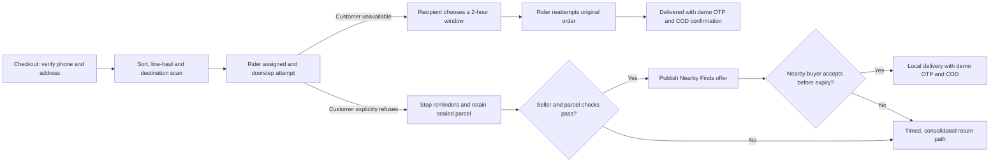

<div align="center">

# Valmo Delivery Journey Studio

### One parcel. Four roles. Two recovery paths.

A clickable, single-parcel prototype that makes the delivery journey visible from checkout to doorstep outcome. Follow the same parcel as it moves through **Operations**, the **Rider app**, the **Recipient app**, and **Nearby Finds**.


</div>

---

## Contents

- [The idea](#the-idea)
- [What you can explore](#what-you-can-explore)
- [Run the prototype](#run-the-prototype)
- [Walkthrough guide](#walkthrough-guide)
- [Demo parcel](#demo-parcel)
- [Project files](#project-files)
- [How the demo works](#how-the-demo-works)
- [Scope and limitations](#scope-and-limitations)
- [Design principles](#design-principles)
- [Built with](#built-with)

---

## The idea

Delivery exceptions often leave customers, riders, and operations teams looking at different pieces of the story. This prototype puts one parcel and its event history at the centre. Each role gets a screen shaped for its task, while every action updates the same simulated journey.

The doorstep decision branches into two distinct outcomes:

- **Customer unavailable:** the customer chooses another delivery window and the rider retries the original order.
- **Customer explicitly refuses:** reminders stop; Operations checks seller and parcel eligibility; an approved, sealed item can be offered to a nearby buyer. If no buyer accepts in time, the parcel moves to a return path.



## What you can explore

| Role | What the screen demonstrates |
|---|---|
| **Operations** | Checkout gate, parcel routing, origin and destination scans, rider assignment, refusal eligibility checks, offer approval, and final disposition. |
| **Rider** | A phone-style delivery task with route context, masked contact, doorstep outcomes, customer-choice distinction, COD confirmation, and delivery OTP. |
| **Recipient** | Meesho-inspired phone screens for checkout, order tracking, delivery-window selection, and a refusal outcome that stops further reminders. |
| **Nearby Finds** | A phone-style local-shopping experience with item condition, seller approval, discount, distance, delivery estimate, and buyer choice. |

The journey strip and event log keep the roles connected: each action is attached to the same parcel ID and appears in the shared activity history.

## Run the prototype

The app is static and has no package installation or build step.

### Recommended: run a local web server

From the project directory, run:

```bash
python -m http.server 8000
```

Then open [http://localhost:8000](http://localhost:8000).

You can also open `index.html` directly in a browser. A local server is more reliable for browser security rules and relative assets.

### Publish with GitHub Pages

This project is a static site, so it can be served from the repository without a build pipeline:

1. Push the project files to a GitHub repository.
2. Open **Settings → Pages** for that repository.
3. Under **Build and deployment**, choose **Deploy from a branch**.
4. Select the branch you want to publish and the project folder (`/` if this project is the repository root).
5. Save, then open the Pages URL shown by GitHub.

If the prototype lives inside a subfolder of a larger repository, publish that folder through an appropriate Pages workflow or move the app files to the site root.

## Walkthrough guide

Start on the **Recipient app** checkout screen. Use the role switcher to move between surfaces; the parcel state remains shared in this browser.

### Path A — unavailable, then successful reattempt

1. On checkout, select **Send OTP** and enter the demo code `4826`.
2. Confirm the delivery address, then place the order.
3. In **Operations**, route the parcel, confirm its destination-hub scan, and assign the rider.
4. In **Rider app**, start the route and record **Customer unavailable**.
5. In **Recipient app**, choose a two-hour delivery window.
6. Return to **Rider app**, enter delivery OTP `7304`, confirm COD collection, and complete delivery.

### Path B — explicit refusal, then local recovery

1. Complete checkout and Operations routing as above.
2. In **Rider app**, start the route and record **Customer explicitly refused**.
3. In **Operations**, review all five seller and parcel eligibility checks, then approve the Nearby Finds offer.
4. In **Nearby Finds**, accept the offer as the local buyer.
5. In **Rider app**, confirm the local handoff with OTP `7304` and the displayed COD amount.

If the offer is not accepted, Operations can advance the demo to its timed-return outcome. Use **Restart** to replay either path from checkout.

> **Demo codes:** checkout `4826` · delivery `7304`. These codes only advance this simulated prototype; they do not send or verify real messages.

## Demo parcel

The prototype is seeded with one example parcel so the walkthrough can start immediately.

| Field | Demo value |
|---|---|
| Parcel ID | `VL-48261` |
| Item | Insulated steel bottle, 750 ml, rose pink |
| Original COD | ₹479 |
| Nearby offer | ₹399 (₹80 lower than the original price) |
| Example local delivery estimate | Approximately 35 minutes |
| Example offer distance | 1.2 km |

**Every name, address, parcel detail, seller, amount, rating, time, distance, route, estimate, and operational value shown in the app is synthetic and for demonstration only.** The calculations and example offer are not measured Valmo or Meesho performance.

## Project files

```text
.
├── index.html          # App entry point
├── app.js              # Screens, shared demo state, event history, and interactions
├── styles.css          # Responsive layouts, phone frames, and visual system
├── assets/
│   ├── rider-avatar.png
│   └── steel-bottle.png
└── README.md
```

No framework, bundler, database, or third-party JavaScript package is required. The interface loads DM Sans and Manrope from Google Fonts when a network connection is available and uses local sans-serif fallbacks otherwise.

## How the demo works

- **One shared parcel state:** Operations, Rider, Recipient, and Nearby Finds render from the same browser-side state.
- **Event history:** actions append a timestamped, role-attributed event to the parcel activity log.
- **Local persistence:** the current walkthrough is saved in this browser with `localStorage`; **Restart** restores the initial checkout state.
- **Branch-specific rules:** an unanswered attempt is not treated as refusal; Nearby Finds only appears after explicit refusal and seller/item approval.
- **No backend:** this is a frontend interaction prototype, not a carrier or ecommerce integration.

## Scope and limitations

This is a case-competition prototype to communicate a service concept and make its handoffs tangible. It does **not** connect to production systems.

- No live Valmo or Meesho APIs, order data, user accounts, seller inventory, or operational telemetry.
- No real SMS, OTP, phone call, GPS, maps, payment, COD collection, or parcel tracking.
- The demo state is local to one browser and does not synchronize across devices or separate browser profiles.
- Nearby Finds eligibility, pricing, stock, delivery estimates, and expiry are sample interactions; operational, seller, legal, and customer validation would be needed before a real launch.
- The interface is an independent concept prototype. Meesho and Valmo names and marks belong to their respective owners; this project is not an official product or endorsement.

## Design principles

1. **One parcel record across roles.** Every handoff should tell the same story.
2. **Customer choice stays explicit.** Unavailable and refused are different outcomes.
3. **Evidence supports review.** A single signal should not automatically decide rider intent or trigger a penalty.
4. **Recovery has guardrails.** A local offer requires seller approval and item checks; otherwise the sealed parcel follows the return path.
5. **Make the next action obvious.** Each screen focuses on the role’s next decision.

## Built with

- Semantic HTML
- CSS Grid, Flexbox, and responsive media queries
- Vanilla JavaScript
- Browser `localStorage`
- DM Sans and Manrope typography

---

<div align="center">

**A delivery exception is still part of the customer journey.**

</div>
